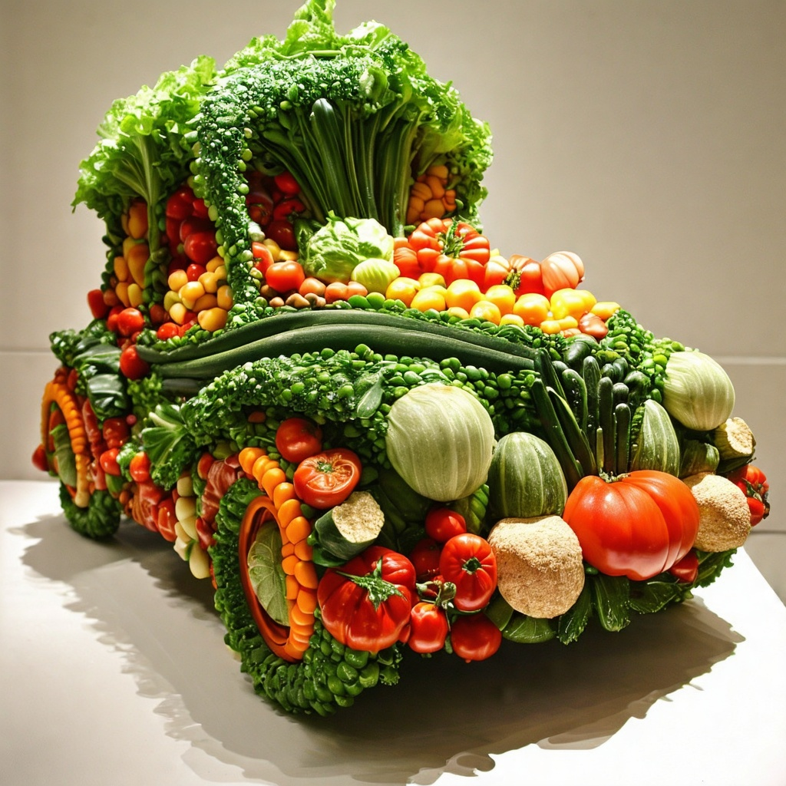

To enhance your guide with the requested images and videos, here’s a refined version with placeholders for embedding the media:

---

### Step-by-Step Guide for AWS Bedrock Image Generator

The following guide will help you set up, run, and use the **AWS Bedrock Image Generator** project from the repository. This project enables you to generate images using AWS Bedrock’s Stable Diffusion models with a simple and user-friendly Streamlit interface.

---

### Prerequisites

Before starting, ensure you have the following:

- **AWS Account**: With access to AWS Bedrock in the `us-west-2` region.
- **AWS CLI Installed**: Configure it with your credentials.
- **Python 3.7+**: Ensure you have Python installed.
- **Pip**: Python package manager for installing dependencies.

---

### Step 1: Clone the Repository

First, clone the project repository to your local environment using Git.

```bash
git clone https://github.com/awsstudygroup/AWS-Bedrock-Image-Generator.git
cd AWS-Bedrock-Image-Generator
```

This will download all necessary files for the application to function properly.

---

### Step 2: Install Dependencies

The project requires several Python libraries to function. You can install all the dependencies listed in the `requirements.txt` file using `pip`.

```bash
pip install -r requirements.txt
```

**Key dependencies:**

- **Streamlit**: Used to create the web app interface.
- **boto3**: AWS SDK for interacting with AWS services, including Bedrock.
- **Pillow**: For image processing and manipulation.

---

### Step 3: Configure AWS Credentials

Make sure your AWS credentials are properly set up on the machine where you will be running the application. You can configure your credentials using the AWS CLI by running:

```bash
aws configure
```

You will be prompted to enter:

- AWS Access Key ID
- AWS Secret Access Key
- Default Region Name: `us-west-2`
- Default Output Format: `json`

This step ensures that your environment can interact with AWS Bedrock.

---

### Step 4: Run the Application

Once all dependencies are installed and AWS credentials are configured, you can run the Streamlit application:

```bash
streamlit run app.py
```

The application will start and open in your default web browser, displaying the interface where you can input your prompt and generate images.

---

### Step 5: Using the Application

Now that the app is running, you can use it to generate images with AWS Bedrock:

1. **Enter a Creative Prompt**: Input the descriptive text that will be used to generate your image. For example: `A landscape painting of mountains during sunrise`.
   
2. **Select a Model**: Choose the Stable Diffusion model you want to use (Stability AI models available via AWS Bedrock).
   
3. **Advanced Options**:
    - **Image Orientation**: Select portrait, landscape, or square.
    - **Generation Steps**: Control how many diffusion steps the model should use.
    - **Seed**: Set a seed for reproducibility of generated images.
    - **Negative Prompts**: Avoid certain elements in your image by using negative prompts.

4. **Generate Image**: Click the `Generate Image` button. The app will send a request to AWS Bedrock for image generation, which may take a few seconds to process.

5. **Download the Image**: Once the images are generated, you can download them directly using the download buttons provided below each image.

**Example Generated Image**:



---

### Example

Here’s how a typical session would look:

- **Prompt**: `A futuristic city with flying cars under a blue sky`
- **Advanced Settings**: Orientation = `Landscape`, Steps = `50`, Seed = `12345`
- **Output**: A high-resolution image based on the provided prompt.


---

### Step 6: Customizing the App (Optional)

If you want to further customize the app (e.g., add new features or change the UI), you can modify the `app.py` file.

---

### Troubleshooting

- **AWS Access Issues**: Make sure your AWS credentials are properly configured and that you have permissions to access AWS Bedrock.
- **Streamlit Errors**: Ensure all dependencies are installed correctly. Run `pip install -r requirements.txt` if missing packages are identified.
- **KeyError: 'generatedImages'**: If you encounter a KeyError while generating images, check the AWS Bedrock API response structure in `boto3` and ensure that the request format is correct in your `app.py`.

---

### Conclusion

This project is a simple yet powerful way to leverage AWS Bedrock's Stable Diffusion models for image generation. By following the steps outlined above, you should be able to successfully set up and use the application.

Happy image generating!

